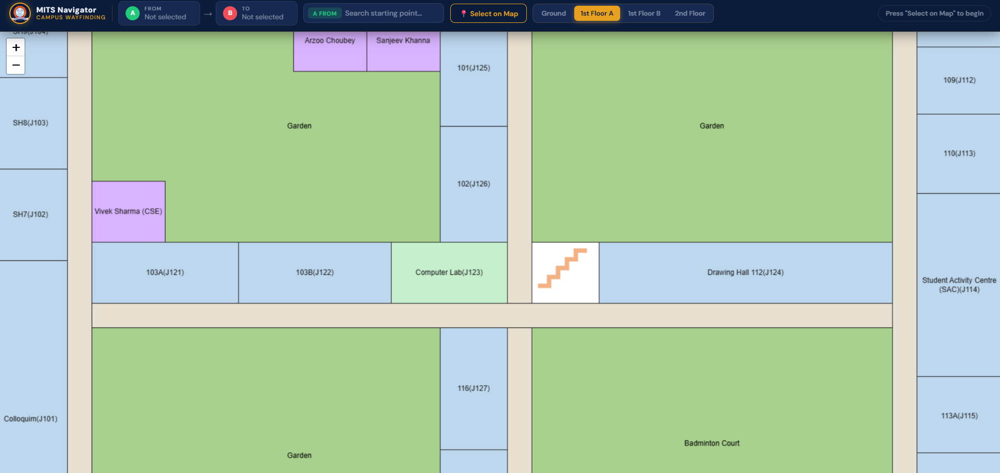
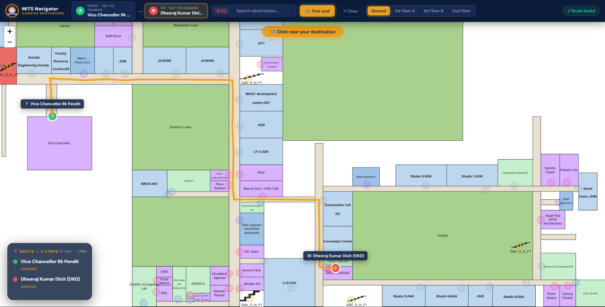
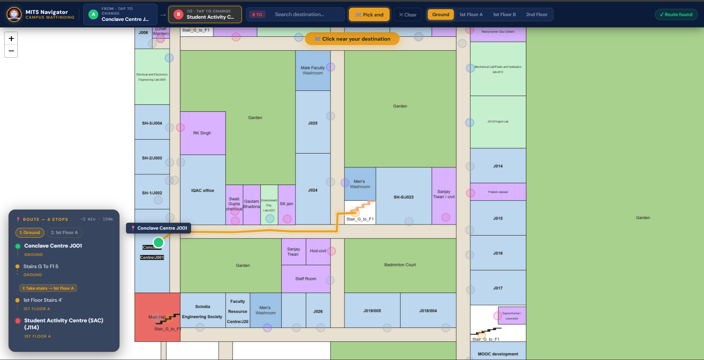
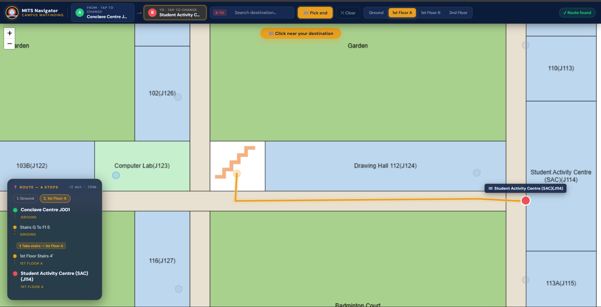
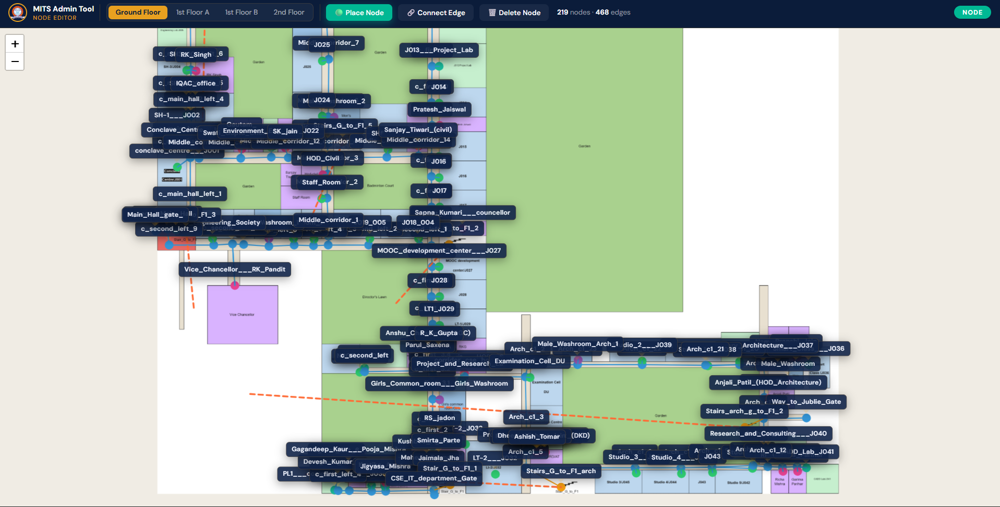

# 🏛️ MITS Smart Campus Navigator

A full-stack indoor navigation system for **Madhav Institute of Technology & Science (MITS), Gwalior** — built with React, Leaflet.js, Node.js, Express, and MongoDB.

Students and visitors can find the shortest path between any two locations across **4 floors** and **400+ mapped nodes**, with real-time multi-floor routing powered by Dijkstra's algorithm.

---

## 📸 Screenshots

### Default Map View


### Single Floor Route


### Multi-Floor Route with Stair Navigation



### Admin Node Editor


---

## ✨ Features

- **Shortest path routing** using Dijkstra's algorithm across 4 floors
- **Multi-floor navigation** with automatic stair detection and floor transition indicators
- **437 mapped nodes** and **467 edges** covering the entire MITS campus
- **Dual input methods** — search by name or click directly on the map
- **Smart search** — search for both starting point and destination independently
- **Estimated walk time and distance** displayed for every route
- **Admin tool** — place nodes, connect edges, and delete nodes via a visual map editor with modal forms (no browser prompts)
- **Clean label formatting** — raw node IDs auto-formatted into human-readable names
- **Responsive UI** — works on desktop and mobile

---

## 🗺️ Campus Coverage

| Floor | Image Size | Nodes |
|-------|-----------|-------|
| Ground Floor | 4642×3924 px | ~219 |
| 1st Floor A | 1742×2442 px | ~120 |
| 1st Floor B | 1111×912 px | ~60 |
| 2nd Floor | 681×852 px | ~40 |

---

## 🛠️ Tech Stack

| Layer | Technology |
|-------|-----------|
| Frontend | React 19, Leaflet.js, React-Leaflet |
| Backend | Node.js, Express 5 |
| Database | MongoDB, Mongoose |
| Build Tool | Vite 8 |
| Routing Algorithm | Dijkstra's (custom implementation) |

---

## 🏗️ Architecture

```
Frontend (React + Leaflet)
    ↓ HTTP requests
Backend (Node.js + Express)
    ├── GET  /api/nodes          — fetch all nodes
    ├── GET  /api/nodes/floor/:n — fetch nodes by floor
    ├── GET  /api/nodes/navigate — run Dijkstra's and return path
    ├── POST /api/nodes          — add a new node
    ├── DELETE /api/nodes        — delete a node
    ├── GET  /api/edges          — fetch all edges
    ├── POST /api/edges          — add a new edge
    └── DELETE /api/edges/:id    — delete an edge
    ↓
MongoDB (nodes + edges collections)
```

---

## ⚙️ How Dijkstra's Works Here

Each node stores its `(x, y)` pixel coordinates on the floor plan image. Edge weights are the Euclidean pixel distance between connected nodes. For stair connections (cross-floor edges), a fixed weight of `200` is used to represent the cost of floor transitions.

The algorithm builds an adjacency list from the edge collection, runs standard Dijkstra's with a priority queue, reconstructs the path via backtracking through the `prev` map, and returns the ordered list of node IDs to the frontend.

---

## 🚀 Getting Started

### Prerequisites
- Node.js >= 20
- MongoDB running locally on port 27017

### Installation

```bash
# Clone the repo
git clone https://github.com/Harshyadav0987/Smart-Campus-navigator.git
cd Smart-Campus-navigator

# Install backend dependencies
cd Backend
npm install

# Install frontend dependencies
cd ../Frontend
npm install
```

### Running the app

```bash
# Terminal 1 — start backend
cd Backend
node index.js

# Terminal 2 — start frontend
cd Frontend
npm run dev
```

Open `http://localhost:5173` in your browser.

### Environment Variables

Create `Backend/.env`:

```env
PORT=5000
MONGO_URI=mongodb://localhost:27017/indoornav
```

---

## 🗂️ Project Structure

```
Smart-Campus-navigator/
├── Backend/
│   ├── models/
│   │   ├── Node.js          # Node schema (id, label, type, floor, x, y)
│   │   └── Edge.js          # Edge schema (from, to, weight, isStair)
│   ├── routes/
│   │   ├── Node.js          # Node routes + navigate endpoint
│   │   └── Edge.js          # Edge routes
│   ├── dijkstra.js          # Dijkstra's algorithm implementation
│   ├── index.js             # Express server entry point
│   └── .env
│
├── Frontend/
│   ├── public/
│   │   ├── ground_floor.png
│   │   ├── first_floor_a.png
│   │   ├── first_floor_b.png
│   ├── src/
│   │   ├── NavMap.jsx       # Main navigation UI
│   │   ├── NavMap.css       # Styles
│   │   ├── AdminMap.jsx     # Admin node editor
│   │   └── App.jsx
│   └── vite.config.js
```

---

## 🔧 Admin Tool

The admin tool (`/src/AdminMap.jsx`) lets you manage the campus graph visually:

- **Place Node** — click anywhere on the map, fill in the room ID and type via a modal form
- **Connect Edge** — click two nodes to create an edge (weight auto-calculated from pixel distance)
- **Delete Node** — click a node to remove it along with all connected edges
- **Cross-floor edges** — select a stair node, switch floors, click the matching stair node on the other floor

To use the admin tool, change `App.jsx` to render `<AdminMap />` instead of `<NavMap />`.

---

## 📊 Node Types

| Type | Description |
|------|-------------|
| `room` | General rooms and offices |
| `corridor` | Hallways and connecting paths |
| `stairs` | Staircase nodes (used for floor transitions) |
| `lab` | Computer and science labs |
| `washroom` | Washrooms |
| `faculty` | Faculty cabins |
| `garden` | Open garden areas |

---

## 🤝 Contributing

Pull requests are welcome. For major changes, please open an issue first.

---

## 📄 License

MIT
